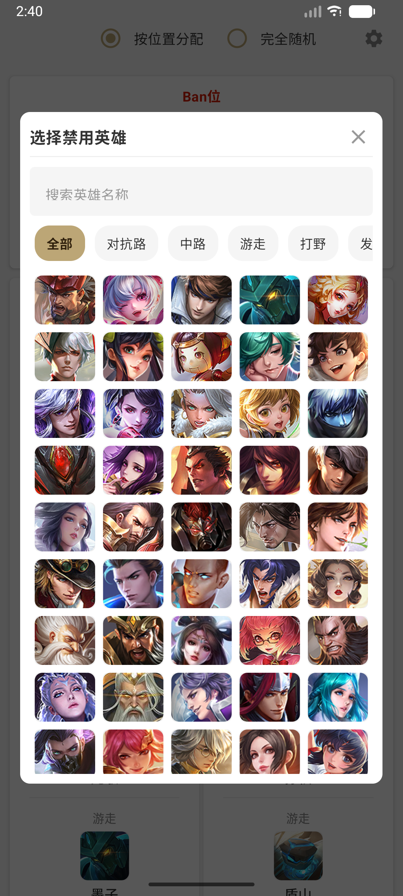
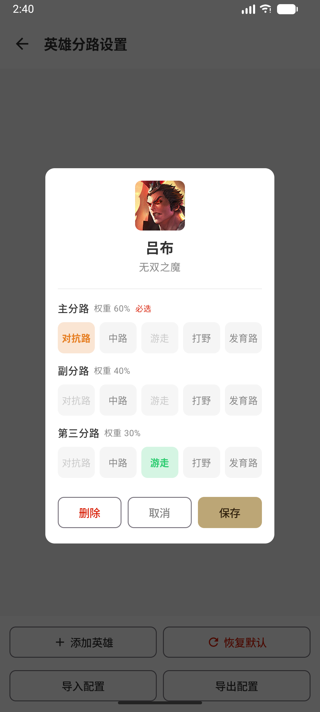
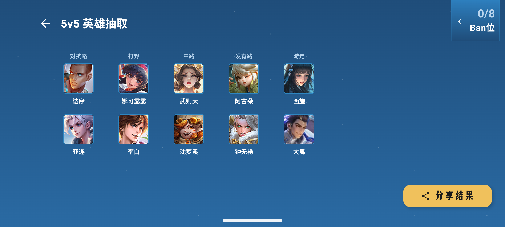

# 🎲 随机英雄 - 王者荣耀随机选将工具

一款基于 Jetpack Compose 的 Android 应用，用于在王者荣耀5v5开房间开黑前随机分配英雄阵容，支持按位置智能匹配、Ban 位排除和结果分享。

## ✨ 功能特性

### 🎮 两种游戏模式
- **按位置随机** — 根据对抗路、中路、游走、打野、发育路五个位置，智能匹配对应类型的英雄（支持加权随机）
- **完全随机** — 忽略位置限制，从所有英雄中随机抽取

### 🚫 Ban 位系统
- 支持最多 **8 个 Ban 位**
- 点击 Ban 位可打开英雄选择器，支持搜索
- 已 Ban 的英雄不会出现在随机结果中
  
### 🔄 重新Roll点
- 对随机结果不满意？可以单独重新 Roll 某一个位置的英雄

### 📸 结果分享
- 一键生成精美的阵容结果图，长按分享按钮进入分享页
- 支持直接分享到社交应用

### 设置页
- 自定义英雄分路配置，新增英雄
### 🌙 深色模式
- 自动跟随系统深色/浅色主题

## 🛠 技术栈

| 技术 | 说明 |
|------|------|
| **Kotlin** | 开发语言 |
| **Jetpack Compose** | 声明式 UI 框架 |
| **Material3** | Material Design 3 设计系统 |
| **MVVM** | 架构模式 (ViewModel + StateFlow) |
| **Coil** | 图片加载库 |
| **FileProvider** | 安全文件分享 |

## 📁 项目结构

```
app/src/main/java/com/example/random/
├── MainActivity.kt          # 入口 Activity
├── data/
│   ├── HeroRepository.kt    # 英雄数据仓库（内置全部英雄数据）
│   └── ImagePreloader.kt    # 图片预加载器
├── model/
│   ├── Hero.kt              # 英雄数据模型
│   ├── HeroCombo.kt         # 羁绊组合模型
│   └── ShareResultData.kt   # 分享结果数据
├── ui/
│   ├── RandomHeroApp.kt     # 主界面 Composable
│   ├── TeamRoomScreen.kt    # 组队房间界面
│   ├── ShareResultScreen.kt # 分享结果界面
│   ├── ShareUtils.kt        # 分享工具类
│   ├── components/           # UI 组件
│   │   ├── BanSection.kt    # Ban 位区域
│   │   ├── HeroAvatar.kt    # 英雄头像组件
│   │   ├── HeroSelectorDialog.kt # 英雄选择弹窗
│   │   ├── ModeSelector.kt  # 模式选择器
│   │   └── TeamColumn.kt    # 队伍列组件
│   └── theme/                # 主题配置
└── viewmodel/
    └── RandomHeroViewModel.kt # 主 ViewModel
```

## 🚀 构建与运行

### 环境要求
- Android Studio Ladybug 或更高版本
- JDK 11+
- Android SDK 33+（API Level 33）

### 构建步骤
```bash
# 克隆项目
git clone <repo-url>

# 进入项目目录
cd random

# 构建 Debug APK
./gradlew assembleDebug

# 构建 Release APK
./gradlew assembleRelease
```

## 🔧 辅助脚本


| 脚本 | 说明 |
|------|------|
| herolist.js | 英雄数据源（JSON 格式），来源于[王者荣耀官网](https://pvp.qq.com/web201605/js/herolist.json) |


### 更新英雄数据
1. 从王者荣耀官网获取最新的 `herolist.json`
2. 将输出结果更新到 `heros.json` 中
3. 设置页z可以自定义英雄分路配置，新增英雄

## 📊 数据来源

英雄数据来自[王者荣耀官方网站](https://pvp.qq.com)，包含英雄编号、中文名、称号、定位、皮肤列表等信息。

## 📄 许可证

本项目仅供学习交流使用。王者荣耀游戏素材版权归腾讯公司所有。禁止商业使用。


